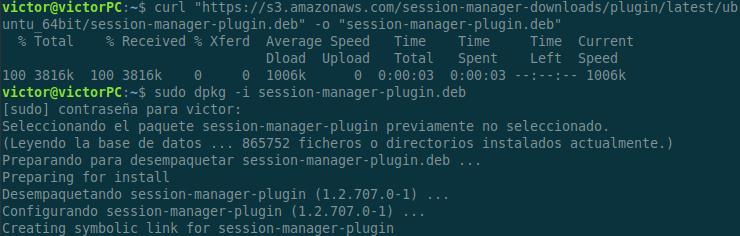

# Overview

The purpose of this lab is to create a VPC with public and private subnets using Terraform. The infrastructure will consist of a VPC, a public and private subnet, an EC2 instance placed in the private subnet, an Internet Gateway attached to the VPC and a Nat Gateway which will provide internet connectivity to our EC2 instance in the private subnet. We will also configure all necessary resources so you can access your instance, including AWS Systems Manager SSM. 


# Set up the AWS Provider
In order to create this infrastructure, we are only going to make use the AWS provider. 

```
#Providers
terraform {
  required_version = "~> 1.10.2"
  required_providers {
    aws = {
      source  = "hashicorp/aws"
      version = "5.87.0"
  }
}
}

#Configuring AWS Provider
provider "aws" {
  region = "us-east-1"
}
```

# Create a VPC and Subnet

We are going to create a custom VPC and a public and private subnet in the same Availability Zone to host our infrastructure.

```
#VPC 
resource "aws_vpc" "main" {
  cidr_block = "10.111.0.0/16"
}

#Subnet Public
resource "aws_subnet" "public_subnet" {
  vpc_id            = aws_vpc.main.id
  cidr_block        = "10.111.1.0/24"
  availability_zone = "us-east-1a"
}

#Subnet Private 
resource "aws_subnet" "private_subnet" {
  vpc_id            = aws_vpc.main.id
  cidr_block        = "10.111.2.0/24"
  availability_zone = "us-east-1a"
}
```

# Create an Internet Gateway
Create and place the Internet Gateway which will give our VPC access to the internet. 

```
#Internet Gateway
resource "aws_internet_gateway" "igw" {
  vpc_id = aws_vpc.main.id
}
```

# Create a Nat Gateway

First we need to create an Elastic IP for our Nat Gateway. Notice that we explicitly associate the Nat Gateway with the EIP and the Internet Gateway created above.

```
#EIP for NAT Gateway
resource "aws_eip" "eip_ngw" {
 domain     = "vpc"
 depends_on = [aws_internet_gateway.igw]
}

#NAT Gateway
resource "aws_nat_gateway" "ngw" {
  allocation_id = aws_eip.eip_ngw.id
  subnet_id     = aws_subnet.public_subnet.id #NATGW must be placed in public subnet
  depends_on    = [aws_internet_gateway.igw]
}


```

# Route tables

We’ll create a route table "public_rtb" for our public subnet and a table "private_rtb" for our private subnet. Notice that the traffic for our public subnet goes through the Internet Gateway and the traffic for our private subnet goes through the Nat Gateway.
We also need to associate the route tables with our public and private subnets respectively. 

```
#Route Tables
#Public Route table
resource "aws_route_table" "public_rtb" {
  vpc_id = aws_vpc.main.id
  route {
    cidr_block = "0.0.0.0/0"
    gateway_id = aws_internet_gateway.igw.id
  }
}
#Private Route Table
resource "aws_route_table" "private_rtb" {
  vpc_id = aws_vpc.main.id
  route {
    cidr_block     = "0.0.0.0/0"
    nat_gateway_id = aws_nat_gateway.ngw.id
  }
}

#Create route table associations
#Associate public Subnet to public route table
resource "aws_route_table_association" "public" {
  subnet_id      = aws_subnet.public_subnet.id
  route_table_id = aws_route_table.public_rtb.id
}
#Associate private Subnet to private route table
resource "aws_route_table_association" "private" {
  subnet_id      = aws_subnet.private_subnet.id
  route_table_id = aws_route_table.private_rtb.id
}
```

# Enable AWS System Manager SSM on our EC2 instance

In order to enable SSM on an EC2 instance we need to create an IAM Role to pass AssumeRule to EC2. Then we need to use aws_iam_role_policy_attachment to attach the policy AmazonSSMManagedInstanceCore to the IAM Role. The Policy AmazonSSMManagedInstanceCore gives AWS Systems Manager service core functionality to EC2. Finally we create an Instance Profile which is needed to pass the IAM Role to our EC2 instance. 

```
#Enable SSM on EC2 (pass IAM ROLE AmazonSSMManagedInstanceCore to EC2)
#Create IAM role/Trust Policy
resource "aws_iam_role" "ssm_role" {
 name = "ssm_role"
 assume_role_policy = jsonencode({
   Version = "2012-10-17"
   Statement = [
     {
       Action = "sts:AssumeRole"
       Effect = "Allow"
       Sid    = ""
       Principal = {
         Service = "ec2.amazonaws.com"
       }
     },
   ]
 })
}


#attach Permission Policy to Trust Policy (role)
resource "aws_iam_role_policy_attachment" "ssm_attach" {
 role       = aws_iam_role.ssm_role.name
 policy_arn = "arn:aws:iam::aws:policy/AmazonSSMManagedInstanceCore"
}


#create instance profile
resource "aws_iam_instance_profile" "ssm_profile" {
 name = "SSMInstanceProfile"
 role = aws_iam_role.ssm_role.name
}

```

# Security Groups

Now we need to create a security group to allow ingress and egress traffic from our EC2 instance. We’ll start by creating the security group aws_security_group.web which will allow HTTP/HTTPS/ICMP ingress traffic and a default route to allow all egress traffic.

```
#Security Group - EC2
resource "aws_security_group" "web" {
 name        = "web"
 description = "allow web traffic"
 vpc_id      = aws_vpc.main.id
}
#Ingress rule for Security Group
resource "aws_vpc_security_group_ingress_rule" "allow_443" {
 security_group_id = aws_security_group.web.id
 cidr_ipv4         = "0.0.0.0/0"
 from_port         = 443
 to_port           = 443
 ip_protocol       = "tcp"
}
#Ingress rule for Security Group
resource "aws_vpc_security_group_ingress_rule" "allow_80" {
 security_group_id = aws_security_group.web.id
 cidr_ipv4         = "0.0.0.0/0"
 from_port         = 80
 to_port           = 80
 ip_protocol       = "tcp"
}
#Ingress rule for Security Group
resource "aws_vpc_security_group_ingress_rule" "allow_icmp" {
 security_group_id = aws_security_group.web.id
 cidr_ipv4         = "0.0.0.0/0"
 from_port         = -1
 to_port           = -1
 ip_protocol       = "icmp"
}
#Egress rule for Security Group
resource "aws_vpc_security_group_egress_rule" "egress_all" {
 security_group_id = aws_security_group.web.id
 cidr_ipv4         = "0.0.0.0/0"
 ip_protocol       = "-1"
}

```
# EC2 Instance

We can now create and place our EC2 instance in the private subnet. We associate the security group aws_security_group.web and the instance profile aws_iam_instance_profile.ssm_profile to it.  

```
#EC2 Instances
resource "aws_instance" "amazon_linux_private_sbnt" {
  ami                  = "ami-05576a079321f21f8"
  instance_type        = "t2.micro"
  security_groups      = [aws_security_group.web.id]
  subnet_id            = aws_subnet.private_subnet.id
  iam_instance_profile = aws_iam_instance_profile.ssm_profile.name
}

```

# Apply Changes

On our local console we need to initialize our project, plan and apply. 

```
terraform init
terraform plan
terraform apply 
```

# Testing

You might have noticed that after applying, we printed the instance’s ID on the console (check the outputs.tf file for the details). You can use this ID to connect to the instance using the AWS CLI, or you can just use the AWS Terminal, select the instance > Connect > Session Manager.
Use the following command to connect to your instance using the AWS CLI and make sure you have installed the [Session Manager plugin](https://docs.aws.amazon.com/systems-manager/latest/userguide/session-manager-working-with-install-plugin.html) for the AWS CLI.

Install the Plugin. I used the Debian/Ubuntu package. Select the adequate package for your machine.



Connect to your EC2 instance using the AWS CLI

```
aws ssm start-session \
	--target instance-id
```


Congratulations! You can now play around with your instance, and don’t forget to destroy your infrastructure when you’re done.